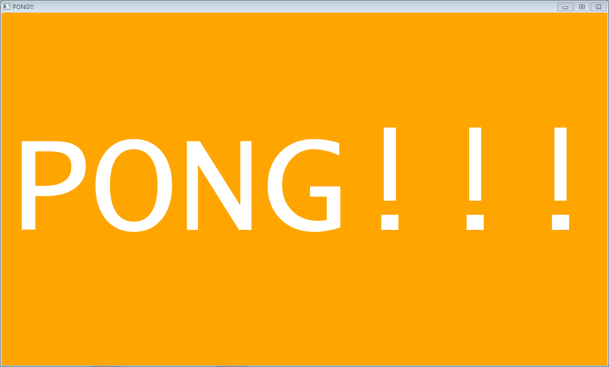
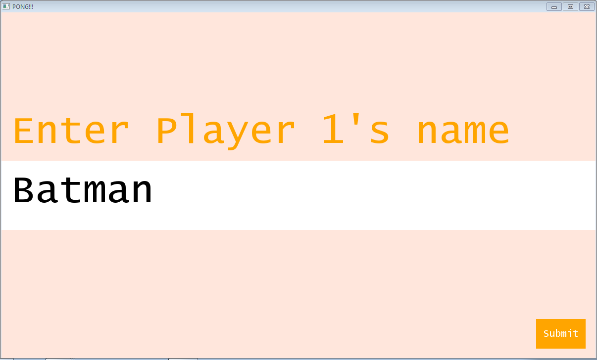
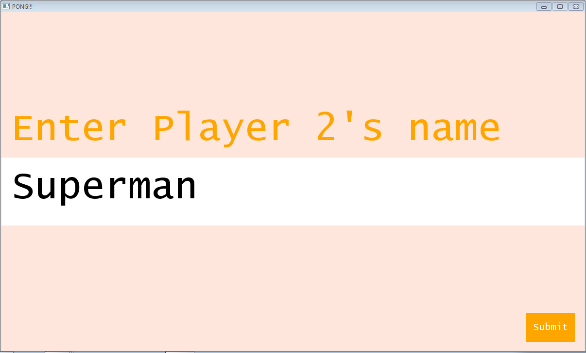
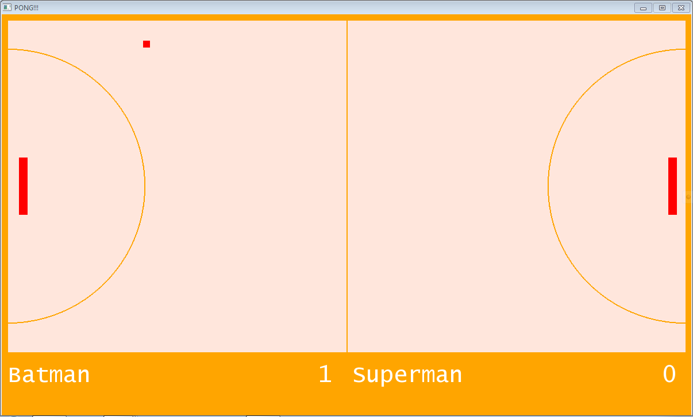
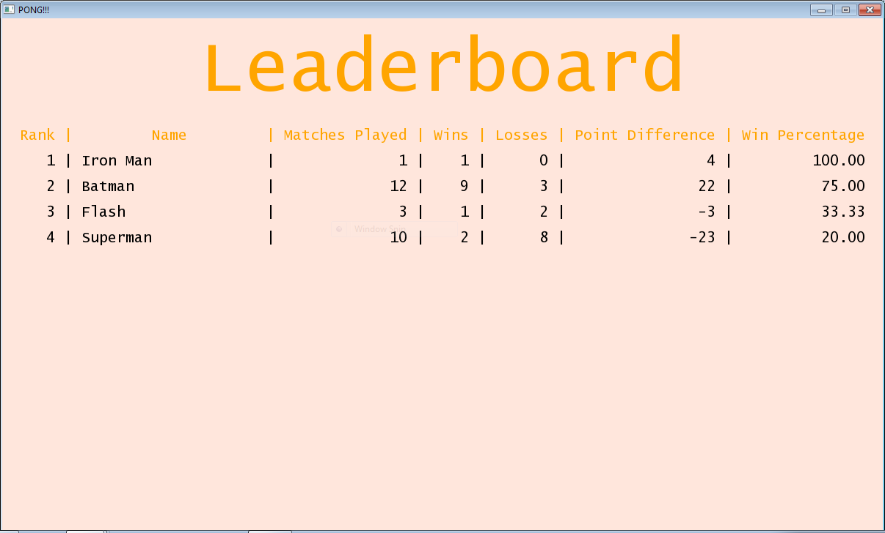

# Pong

A simple version of the classic digital tennis game re-created in Python with Pygame.

## Installation

Download the latest version of this game by the command

```bash
git clone --depth=1 https://github.com/stormalinblue/Pong.git 
```

## Usage

`cd` into the installation directory

### On Ubuntu

```bash
sudo apt install pip
pip install pygame
python main.py
```

### On Windows

```bash
pip install pygame
```

## Play


### Splash Screen

You should see the following screen.



### Player 1 Name

On the first screen, enter the first player's name. This person will appear on the left.



### Player 2 Name

On the second screen, enter the second player's name. This person will appear on the right.



### Game Play

The first player uses the `W` and `S` keys to control the left player, while the second player uses the `↑` (up) and `↓` (down) keys.



### Leaderboard

After game play, the scores are added to the table, which keeps a record of the best players.

